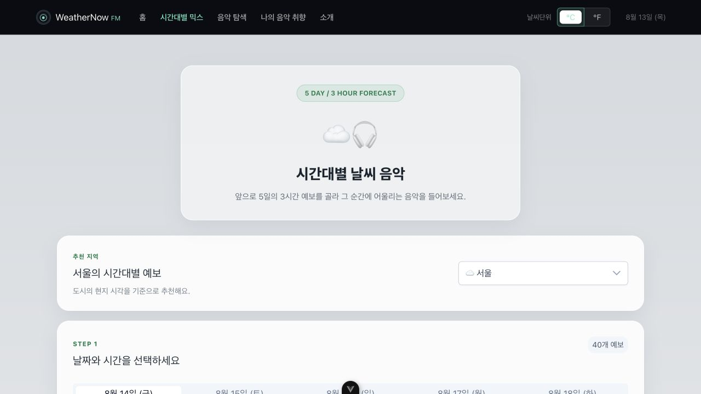
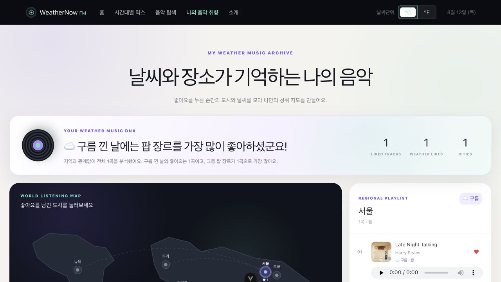

# WeatherNow FM

> 실시간 날씨와 시간대별 예보를 음악 추천으로 연결하는 Vue 3 기반 Weather-driven Music Discovery 서비스

WeatherNow FM은 단순히 날씨를 확인하는 대시보드가 아니라, 현재 도시의 하늘과 앞으로의 날씨에 어울리는 음악을 발견하고 좋아요 기록을 통해 나의 날씨별 음악 취향을 확인하는 웹 애플리케이션입니다.

OpenWeatherMap의 현재 날씨 및 5 Day / 3 Hour Forecast 데이터와 iTunes Search API의 음악 데이터를 Axios로 불러옵니다. Vue Router로 페이지를 구성하고 Pinia로 온도 단위, 날씨, 좋아요 및 음악 취향 상태를 관리하며 PrimeVue와 Chart.js로 UI를 구현했습니다.

## 1. 사이트 소개

### 홈 — 현재 날씨를 한 곡의 음악으로

기본 도시인 서울의 현재 날씨를 받아 온도, 체감 온도, 습도, 강수량, 구름, 풍속, 기압, 가시거리를 표시합니다. 날씨와 시간대를 분석해 iTunes 음악을 추천하며, 왼쪽의 바이닐 레코드가 재생 화면처럼 회전합니다. 아래에서는 도시 검색, 다중 필터, 도시별 기온 비교와 지역별 날씨 카드를 확인할 수 있습니다.


### 시간대별 믹스 — 5일간의 3시간 예보 플레이리스트

도시와 날짜, 3시간 단위 예보를 선택하면 해당 시점의 날씨와 시간대에 맞는 검색어를 만들고 음악을 추천합니다. 추천 곡에 좋아요를 남기면 당시 도시와 날씨 정보가 함께 저장됩니다.



### 나의 음악 취향 — 날씨·지역·장르별 좋아요 분석

좋아요를 남긴 곡을 지역, 날씨, 장르 기준으로 분석합니다. 상단 요약 배너에서 가장 많이 좋아한 날씨와 장르를 알려주고, 세계지도와 대한민국 지도에서 도시별 기록을 선택해 오른쪽 플레이리스트로 확인할 수 있습니다.



### 주요 기능

- OpenWeatherMap Current Weather Data 기반 현재 날씨 조회
- OpenWeatherMap 5 Day / 3 Hour Forecast 기반 시간대별 음악 추천
- iTunes Search API 기반 앨범 이미지, 아티스트, 장르 및 미리듣기 데이터 조회
- 한글 및 초성 도시 검색, 날씨·즐겨찾기·최저 기온 다중 필터
- 섭씨/화씨 전환과 메인·상세·예보 화면의 단위 동기화
- 좋아요 당시 도시·날씨·장르 저장 및 음악 취향 통계 계산
- 세계지도에서 대한민국으로 확대되는 지역별 취향 지도와 플레이리스트

### 기술 스택

| 구분 | 사용 기술 |
| --- | --- |
| Frontend | Vue 3, Composition API, Vite |
| Routing / State | Vue Router, Pinia |
| UI / Chart | PrimeVue, PrimeIcons, Chart.js |
| HTTP / API | Axios, OpenWeatherMap API, iTunes Search API |
| Quality | ESLint, Oxlint, Prettier |

## 2. 디렉터리 구조 및 설명

```text
skala-vue/
├── docs/
│   └── screenshots/                 # README에 사용하는 실제 앱 화면
├── public/                          # 정적 리소스
├── src/
│   ├── api/
│   │   ├── openWeatherApi.js        # 현재 날씨·5일/3시간 예보 Axios 요청
│   │   └── iTunesApi.js             # iTunes Search Axios 요청
│   ├── assets/
│   │   ├── base.css                 # 기본 태그 및 공통 초기 스타일
│   │   ├── main.css                 # WeatherNow FM 전역 스타일
│   │   └── practice.css             # 기존 Vue 실습용 스타일
│   ├── components/
│   │   ├── exercise/weather/        # 날씨·음악 서비스용 재사용 컴포넌트
│   │   │   ├── BaseDashboardCard.vue
│   │   │   ├── CurrentWeatherMusicHero.vue
│   │   │   ├── SearchBar.vue
│   │   │   ├── FilterBox.vue
│   │   │   ├── WeatherCard.vue
│   │   │   ├── WeatherStats.vue
│   │   │   ├── UnitToggler.vue
│   │   │   ├── TasteSummaryBanner.vue
│   │   │   ├── MusicTasteMap.vue
│   │   │   ├── WorldTasteMap.vue
│   │   │   ├── KoreaTasteMap.vue
│   │   │   └── LikedPlaylistPanel.vue
│   │   └── practices/               # Vue 기본·Composition·이벤트·라이브러리 실습
│   ├── router/
│   │   └── index.js                 # Lazy Loading, 동적 경로, Catch-all 라우트
│   ├── stores/
│   │   ├── configStore.js           # 온도 단위 상태·getter·action
│   │   ├── weatherStore.js          # 도시 목록과 실제 날씨 상태
│   │   └── musicStore.js            # 음악 검색, 좋아요, 날씨별 취향 상태
│   ├── theme/
│   │   └── weatherPreset.js         # PrimeVue 커스텀 테마 프리셋
│   ├── views/
│   │   ├── WeatherHomeView.vue      # 홈 대시보드
│   │   ├── WeatherDetailView.vue    # 도시별 동적 상세 페이지
│   │   ├── ForecastMusicView.vue    # 5일/3시간 예보 음악 추천
│   │   ├── WeatherMusicView.vue     # 도시별 음악 탐색
│   │   ├── MusicTasteView.vue       # 날씨·지역별 음악 취향 분석
│   │   ├── WeatherAboutView.vue     # 서비스 소개
│   │   └── NotFoundView.vue         # 존재하지 않는 경로 안내
│   ├── App.vue                      # 내비게이션, 단위 토글, RouterView
│   ├── Practice*App.vue             # 수업 단계별 실습 진입 컴포넌트 보관
│   └── main.js                      # Vue·Pinia·Router·PrimeVue 전역 등록
├── .env.example                     # 환경 변수 이름 예시
├── .gitignore                       # 키가 들어가는 .env.local 등 제외
├── vercel.json                      # iTunes 배포 프록시와 SPA Rewrite
├── vite.config.js                   # Vue 플러그인과 iTunes 개발·preview 프록시
└── package.json                     # 의존성 및 실행 스크립트
```

## 3. 과제별 해당 파일

초기 단계의 `WeatherMockup.vue`, `WeatherComposition.vue`, `WeatherParent.vue`는 기능을 최종 앱으로 발전시키면서 별도 파일로 유지하지 않았습니다. 아래 표는 각 과제 요구사항이 현재 어느 파일에 반영되어 있는지 보여줍니다.

### Weather Mockup

| 요구사항 | 현재 해당 파일 | 구현 내용 |
| --- | --- | --- |
| 배열 렌더링과 `:key` | `src/views/WeatherHomeView.vue` | 필터링된 도시 배열을 `v-for`와 `:key="item.id"`로 렌더링 |
| 더움/선선함 조건 표시 | `src/components/exercise/weather/WeatherCard.vue` | 25°C를 기준으로 `v-if/v-else` 상태 라벨 표시 |
| 한글 도시 검색 | `src/components/exercise/weather/SearchBar.vue` | `:value`, `@input`과 `update-query` emit으로 한글·초성 검색 지원 |
| 카드 선택과 상세보기 | `WeatherHomeView.vue`, `WeatherCard.vue` | `select-card`, `click-detail` 이벤트를 사용하고 상세 버튼은 버블링 없이 라우터 이동 |
| 본인만의 데이터와 Mockup | `src/stores/weatherStore.js`, `FilterBox.vue`, `WeatherStats.vue` | 국내·해외 도시, 습도·풍속, 즐겨찾기, 다중 필터와 통계 추가 |

### Weather Composition

| 요구사항 | 현재 해당 파일 | 구현 내용 |
| --- | --- | --- |
| 반응형 상태 | `src/views/WeatherHomeView.vue` | `searchQuery`, `selectedCityInfo`, 필터 상태를 `ref`로 관리 |
| 검색 결과 Computed | `src/views/WeatherHomeView.vue` | `filteredWeatherList`에서 검색어와 다중 조건을 함께 계산 |
| `watch` / `watchEffect` | `src/views/WeatherHomeView.vue` | 선택 도시와 검색어 변화를 감시하고 콘솔에 기록 |
| 검색 결과 조건부 표시 | `src/views/WeatherHomeView.vue` | 전체·검색 결과·검색 결과 없음 상태를 구분해 렌더링 |
| 추가 반응형 기능 | `WeatherHomeView.vue`, `FilterBox.vue` | 날씨, 국내/해외, 정렬, 즐겨찾기, 최저 기온 필터 추가 |

### Weather Component

| 역할 | 현재 해당 파일 | 설명 |
| --- | --- | --- |
| 부모 컴포넌트 | `src/views/WeatherHomeView.vue` | 기존 `WeatherParent` 역할과 모든 화면 상태·이벤트를 관리 |
| 공통 슬롯 카드 | `src/components/exercise/weather/BaseDashboardCard.vue` | 검색·필터·날씨 리스트 영역을 slot으로 주입 |
| 검색 컴포넌트 | `src/components/exercise/weather/SearchBar.vue` | props로 검색어를 받고 `:value`, `@input`으로 변경값 전달 |
| 날씨 카드 | `src/components/exercise/weather/WeatherCard.vue` | 도시 객체를 props로 받고 `select-card`, `click-detail` 이벤트 전달 |
| 추가 분리 컴포넌트 | `FilterBox.vue`, `WeatherStats.vue`, `CurrentWeatherMusicHero.vue` | 필터, 도시 통계, 현재 날씨 음악 추천을 독립 컴포넌트로 구성 |

각 컴포넌트의 전용 디자인은 해당 Vue 파일의 `<style scoped>`에 배치했습니다.

### Weather Router

| 요구사항 | 현재 해당 파일 |
| --- | --- |
| Router 전역 주입 | `src/main.js` |
| Lazy Loading, 동적 경로, Catch-all | `src/router/index.js` |
| Navigation Bar와 `RouterView` | `src/App.vue` |
| 메인 대시보드와 Programmatic Navigation | `src/views/WeatherHomeView.vue` |
| `:cityId` 기반 상세 페이지 | `src/views/WeatherDetailView.vue` |
| 서비스 소개와 홈 이동 | `src/views/WeatherAboutView.vue` |
| 404 페이지 | `src/views/NotFoundView.vue` |
| 본인 추가 라우트 | `ForecastMusicView.vue`, `WeatherMusicView.vue`, `MusicTasteView.vue` |

### Weather Store

| 요구사항 | 현재 해당 파일 | 구현 내용 |
| --- | --- | --- |
| `unit` state | `src/stores/configStore.js` | 초기값 `celsius`와 선택 단위 유지 |
| `unitSymbol` getter | `src/stores/configStore.js` | 현재 단위에 따라 °C / °F 반환 |
| `toggleUnit` action | `src/stores/configStore.js` | 알림창 없이 섭씨·화씨 전환 |
| 내비게이션 단위 UI | `src/components/exercise/weather/UnitToggler.vue`, `src/App.vue` | 내비게이션 오른쪽에 단위 선택 버튼 배치 |
| 메인·상세·예보 단위 적용 | `WeatherCard.vue`, `WeatherStats.vue`, `WeatherDetailView.vue`, `ForecastMusicView.vue` | Store의 변환 함수를 통해 온도를 일관되게 표시 |
| 본인 추가 Store | `src/stores/weatherStore.js`, `src/stores/musicStore.js` | 실제 날씨, 도시 즐겨찾기, 음악 검색·좋아요·취향 통계 관리 |

### Weather UI Library

| 요구사항 | 현재 해당 파일 | 구현 내용 |
| --- | --- | --- |
| PrimeVue 적용 | `src/main.js`, `src/theme/weatherPreset.js`, 서비스용 컴포넌트 전반 | Button, Select, InputText, ToggleSwitch, Slider, Tag, Skeleton 등의 UI 적용 |
| OpenWeatherMap 현재 날씨 | `src/api/openWeatherApi.js`, `src/stores/weatherStore.js`, `CurrentWeatherMusicHero.vue` | 서울을 기본 도시로 현재 날씨와 상세 관측값 표시 |
| 추가 OpenWeatherMap API | `src/api/openWeatherApi.js`, `src/views/ForecastMusicView.vue` | 5 Day / 3 Hour Forecast로 시간대별 추천 구성 |
| 기타 외부 API | `src/api/iTunesApi.js`, `CurrentWeatherMusicHero.vue`, `WeatherMusicView.vue`, `ForecastMusicView.vue` | iTunes 검색 결과를 날씨·시간대별 음악 추천에 사용 |
| 차트 라이브러리 | `src/components/exercise/weather/WeatherStats.vue` | Chart.js로 도시별 기온 비교 시각화 |

### Weather Refinement

| 요구사항 | 현재 해당 파일 | 구현 내용 |
| --- | --- | --- |
| 외부 라이브러리와 기능 정비 | `package.json`, `src/main.js`, API·Store 파일 | PrimeVue, Chart.js, Axios, Pinia 연동 |
| 스타일 완성도 개선 | `src/App.vue`, `src/assets/main.css`, `src/theme/weatherPreset.js`, 서비스용 컴포넌트 | 음악 서비스 중심의 반응형 화면과 공통 테마 구성 |
| 본인 추가 기능 | `CurrentWeatherMusicHero.vue`, `MusicTasteView.vue`, 지도·플레이리스트 컴포넌트 | 회전 바이닐 추천과 지역·날씨·장르별 취향 분석 구현 |
| README 정리 | `README.md`, `docs/screenshots/` | 사이트 소개, 실제 화면, 구조, 과제별 파일 대응 기록 |

### Weather Deployment

| 요구사항 | 현재 상태 | 관련 파일 |
| --- | --- | --- |
| ESLint Error 제거 | 완료 | `eslint.config.js`, `src/components/practices/event/EventModifier.vue` 등 전체 소스 |
| API 키 환경 변수화 | 완료 | `.env.example`, `.env.local`, `.gitignore` |
| Production Build | 완료 | `package.json`의 `npm run build` |
| iTunes 프로덕션 프록시 | 설정 완료 | `vercel.json`의 `/itunes-api/:path*` 외부 Rewrite |
| SPA 새로고침 404 방지 | 설정 완료 | `vercel.json`의 `/(.*)` → `/index.html` Rewrite |
| 정적 파일 Hosting | 미진행 | Vercel 프로젝트 연결과 실제 배포 필요 |

## 실행 방법

### 1. 패키지 설치

```sh
npm install
```

### 2. 환경 변수 설정

`.env.example`을 참고해 프로젝트 루트에 `.env.local`을 만들고 OpenWeatherMap 키를 입력합니다.

```env
VITE_OPENWEATHER_API_KEY=your_openweathermap_api_key
```

실제 API 키는 Git에 올리지 않습니다.

### 3. 개발 서버 실행

```sh
npm run dev
```

### 4. 품질 검사와 빌드

```sh
npm run lint
npm run build
npm run preview
```

## API 출처

- [OpenWeatherMap Current Weather Data](https://openweathermap.org/current)
- [OpenWeatherMap 5 Day / 3 Hour Forecast](https://openweathermap.org/forecast5)
- [iTunes Search API](https://performance-partners.apple.com/search-api)
